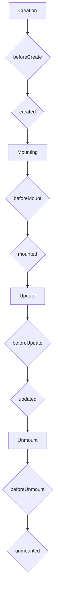

# Vue.js Course: From Zero to Hero (Kinyarwanda)

## Igice cya 1: Intangiriro kuri Vue.js

### Vue.js ni iki?

Vue.js ni **JavaScript framework** ikoreshwa mu gukora user interfaces (UI) n'applications zikora mu buryo bwihuse (single-page applications - SPAs). Yashinzwe na Evan You mu mwaka wa 2014, ikaba izwiho koroha mu kwiga no gukoresha, kandi ikagira ubushobozi bwo gukora applications zikomeye. Vue.js yemerera abaprogramu gukora UI mu buryo bwa **component-based architecture**, aho buri gice cya UI kiba ari component yigenga [1].

**Impamvu ikoreshwa cyane:**

*   **Koroha mu kwiga no gukoresha**: Syntax yayo iroroshye kandi irumvikana, bigatuma abatangira kuyikoresha bayimenyera vuba.
*   **Flexibility**: Irashobora gukoreshwa mu mishinga mito kugeza ku minini, kandi irashobora guhuzwa n'izindi libraries cyangwa frameworks.
*   **Performance**: Ikorana na Virtual DOM, bigatuma applications zikora vuba kandi neza.
*   **Community**: Ifite abayikoresha benshi ku isi, bigatuma kubona ubufasha byoroha.

### Gushyiraho Vue.js

Ushobora gushyiraho Vue.js mu buryo butandukanye:

#### 1. CDN (Content Delivery Network)

Ubu ni uburyo bworoshye bwo gutangira gukoresha Vue.js, cyane cyane ku mishinga mito cyangwa iyo ushaka kugerageza vuba. Ongeraho script tag mu HTML file yawe:

```html
<!DOCTYPE html>
<html>
<head>
  <title>My First Vue App</title>
  <script src="https://unpkg.com/vue@3/dist/vue.global.js"></script>
</head>
<body>
  <div id="app">
    {{ message }}
  </div>

  <script>
    const { createApp } = Vue

    createApp({
      data() {
        return {
          message: 'Muraho, Vue!'
        }
      }
    }).mount('#app')
  </script>
</body>
</html>
```

#### 2. Vue CLI (Command Line Interface)

Vue CLI ni igikoresho gikomeye cyo gukora no gucunga imishinga ya Vue.js. Gitanga ibikoresho byuzuye byo gukora applications zikomeye. Ubanza ugashyiraho Node.js na npm (cyangwa yarn), hanyuma ugashyiraho Vue CLI:

```bash
npm install -g @vue/cli
vue create my-vue-app
cd my-vue-app
npm run serve
```

#### 3. Vite

Vite ni igikoresho gishya kandi cyihuse cyo gukora imishinga ya JavaScript, harimo na Vue.js. Kirihuta cyane kurusha Vue CLI mu gutangira no gukora development server. Ubanza ugashyiraho Node.js na npm (cyangwa yarn), hanyuma ugakoresha Vite:

```bash
npm init vue@latest
# cyangwa yarn create vue@latest
# cyangwa pnpm create vue@latest

cd <your-project-name>
npm install
npm run dev
```

### Component-based Architecture

Vue.js ikoresha uburyo bwa **component-based architecture**. Ibi bivuze ko application yawe igabanyijemo ibice bito byigenga, buri gice kikaba kitwa **component**. Urugero, muri game, ushobora kugira component ya 'Player', 'Enemy', 'Scoreboard', n'izindi. Buri component igira HTML template yayo, JavaScript logic yayo, na CSS yayo [2].

**Akamaro ka component-based architecture:**

*   **Modularity**: Burya component ikora akazi kayo gusa, bigatuma code yoroha gusoma no kuyicunga.
*   **Reusability**: Ushobora gukoresha component imwe ahantu henshi muri application yawe, bigabanya umubare wa code wandika.
*   **Maintainability**: Iyo habaye ikibazo muri component imwe, biroroha kugikemura kuko ntibigira ingaruka kuri application yose.

```html
<!-- Urugero rwa component yoroheje muri Vue.js -->
<template>
  <button @click="increment">{{ count }}</button>
</template>

<script>
export default {
  data() {
    return {
      count: 0
    }
  },
  methods: {
    increment() {
      this.count++
    }
  }
}
</script>

<style scoped>
button {
  background-color: #4CAF50;
  color: white;
  padding: 10px 20px;
  border: none;
  cursor: pointer;
}
</style>
```

### References

[1] Vue.js Official Documentation - What is Vue?: [https://vuejs.org/guide/introduction.html](https://vuejs.org/guide/introduction.html)
[2] Vue.js Official Documentation - Components Basics: [https://vuejs.org/guide/essentials/component-basics.html](https://vuejs.org/guide/essentials/component-basics.html)

## Igice cya 2: Ibishingwe bya Vue.js

### Data Binding

**Data binding** ni uburyo bwo guhuza data iri muri JavaScript na HTML template. Vue.js itanga uburyo bubiri bw'ingenzi bwo gukora data binding:

#### 1. V-bind (One-way Data Binding)

**V-bind** ikoreshwa mu guhuza agaciro ka attribute ya HTML n'agaciro ka data iri muri JavaScript. Ibi bivuze ko iyo data muri JavaScript ihindutse, attribute muri HTML nayo ihinduka, ariko si mu buryo bunyuranye (one-way). Ushobora kuyikoresha ku ma-attribute yose ya HTML, nka `src`, `href`, `class`, `style`, n'izindi. Inzira ngufi yo kuyikoresha ni `:`. [3]

**Urugero:**

```html
<template>
  
  <a :href="linkUrl">Genda kuri Google</a>
  <p :class="{ active: isActive, 'text-danger': hasError }">Ubu butumwa burahinduka</p>
</template>

<script>
export default {
  data() {
    return {
      imageUrl: 'https://via.placeholder.com/150',
      imageAlt: 'Placeholder Image',
      linkUrl: 'https://www.google.com',
      isActive: true,
      hasError: false
    }
  }
}
</script>

<style scoped>
.active {
  color: blue;
}
.text-danger {
  color: red;
}
</style>
```

#### 2. V-model (Two-way Data Binding)

**V-model** ikoreshwa cyane cyane ku ma-form inputs (nka `input`, `textarea`, `select`). Ituma agaciro ka input gahuza na data muri JavaScript, kandi iyo input ihindutse, data nayo ihinduka, ndetse n'iyo data ihindutse, input nayo ihinduka (two-way). [4]

**Urugero:**

```html
<template>
  <input type="text" v-model="name" placeholder="Andika izina ryawe">
  <p>Izina ryawe ni: {{ name }}</p>

  <textarea v-model="message" placeholder="Andika ubutumwa"></textarea>
  <p>Ubutumwa bwawe ni: {{ message }}</p>

  <select v-model="selected">
    <option disabled value="">Hitamo kimwe</option>
    <option>A</option>
    <option>B</option>
    <option>C</option>
  </select>
  <p>Wahisemo: {{ selected }}</p>
</template>

<script>
export default {
  data() {
    return {
      name: '',
      message: '',
      selected: ''
    }
  }
}
</script>
```

### Directives

**Directives** ni ama-attribute adasanzwe muri Vue.js atangira na `v-` (nk'uko twabonye `v-bind` na `v-model`). Akoreshwa mu guhindura imyitwarire ya DOM (Document Object Model) bitewe na data. [5]

#### 1. V-if, V-else-if, V-else (Conditional Rendering)

Izi directives zikoreshwa mu kwerekana cyangwa guhisha ibice bya HTML bitewe n'imiterere runaka (condition). `v-if` ituma element idakora render na gato niba condition itujuje. [6]

**Urugero:**

```html
<template>
  <button @click="toggleVisible">Hindura</button>
  <p v-if="isVisible">Ubu butumwa buragaragara</p>
  <p v-else-if="isLoggedIn">Murakaza neza!</p>
  <p v-else>Nyamuneka injira</p>
</template>

<script>
export default {
  data() {
    return {
      isVisible: true,
      isLoggedIn: false
    }
  },
  methods: {
    toggleVisible() {
      this.isVisible = !this.isVisible;
    }
  }
}
</script>
```

#### 2. V-show (Conditional Display)

**V-show** nayo ikoreshwa mu kwerekana cyangwa guhisha ibice bya HTML, ariko itandukanye na `v-if`. `v-show` ituma element ihora iri muri DOM, ariko ikayihisha ikoresheje CSS `display` property. Ibi bituma `v-show` yihuta kurusha `v-if` iyo ugiye guhindura imiterere kenshi. [7]

**Urugero:**

```html
<template>
  <button @click="toggleShow">Hindura Kugaragara</button>
  <p v-show="isShow">Ubu butumwa buragaragara na v-show</p>
</template>

<script>
export default {
  data() {
    return {
      isShow: true
    }
  },
  methods: {
    toggleShow() {
      this.isShow = !this.isShow;
    }
  }
}
</script>
```

#### 3. V-for (List Rendering)

**V-for** ikoreshwa mu kwerekana urutonde rw'ibintu (list) ukoresheje data iri muri array. Buri kintu mu rutonde kiba gifite key idasanzwe kugira ngo Vue.js ibashe gucunga neza ibintu. [8]

**Urugero:**

```html
<template>
  <ul>
    <li v-for="item in items" :key="item.id">
      {{ item.text }}
    </li>
  </ul>

  <ol>
    <li v-for="(value, key, index) in myObject" :key="key">
      {{ index }}. {{ key }}: {{ value }}
    </li>
  </ol>
</template>

<script>
export default {
  data() {
    return {
      items: [
        { id: 1, text: 'Item 1' },
        { id: 2, text: 'Item 2' },
        { id: 3, text: 'Item 3' }
      ],
      myObject: {
        title: 'My Title',
        author: 'Manus AI',
        year: 2026
      }
    }
  }
}
</script>
```

#### 4. V-on (Event Handling)

**V-on** ikoreshwa mu gucunga ibikorwa (events) bibera kuri HTML elements, nka `click`, `submit`, `keydown`, n'ibindi. Inzira ngufi yo kuyikoresha ni `@`. [9]

**Urugero:**

```html
<template>
  <button @click="handleClick">Kanda hano</button>
  <p>Wakandze inshuro: {{ count }}</p>

  <input type="text" @keydown.enter="submitForm" placeholder="Andika hanyuma ukande Enter">
</template>

<script>
export default {
  data() {
    return {
      count: 0
    }
  },
  methods: {
    handleClick() {
      this.count++;
    },
    submitForm() {
      alert('Form yoherejwe!');
    }
  }
}
</script>
```

### Computed Properties na Watchers

#### Computed Properties

**Computed properties** ni functions zibarwa gusa iyo data zishingiyeho zahindutse. Zikoreshwa mu kubara agaciro gashya kenshi gashingiye kuri data isanzwe, ariko zikaba zifite akamaro ko kuba zibika agaciro kabariwe (cached) kugeza igihe data zishingiyeho zihindukiye. Ibi bituma zihuta cyane. [10]

**Urugero:**

```html
<template>
  <input type="number" v-model="price">
  <input type="number" v-model="quantity">
  <p>Igiciro cyose: {{ totalPrice }}</p>
</template>

<script>
export default {
  data() {
    return {
      price: 0,
      quantity: 0
    }
  },
  computed: {
    totalPrice() {
      return this.price * this.quantity;
    }
  }
}
</script>
```

#### Watchers

**Watchers** zikoreshwa mu gukora ibikorwa runaka iyo data runaka ihindutse. Zikoreshwa cyane cyane iyo ukeneye gukora asynchronous operations cyangwa operations zikomeye iyo data ihindutse. [11]

**Urugero:**

```html
<template>
  <input type="text" v-model="question" placeholder="Baza ikibazo">
  <p>{{ answer }}</p>
</template>

<script>
export default {
  data() {
    return {
      question: '',
      answer: 'Ntegereje ikibazo cyawe...'
    }
  },
  watch: {
    question(newQuestion, oldQuestion) {
      if (newQuestion.includes('?')) {
        this.getAnswer();
      }
    }
  },
  methods: {
    getAnswer() {
      this.answer = 'Ntekereza...';
      setTimeout(() => {
        this.answer = 'Yego, birashoboka!';
      }, 1000);
    }
  }
}
</script>
```

### Components: Gukora no Gukoresha Components, Props, Events, Slots

Nk'uko twabibonye mu gice cya 1, components ni ibice by'ingenzi bya Vue.js. Reka turebe uburyo dukora kandi tugakoresha components, ndetse n'uburyo zivugana.

#### Gukora Component

Buri component iba muri file yayo ifite extension `.vue` (Single File Component - SFC). Iyi file iba igizwe n'ibice bitatu: `<template>`, `<script>`, na `<style>`. [12]

**Urugero: `MyButton.vue`**

```html
<!-- MyButton.vue -->
<template>
  <button @click="handleClick">{{ text }}</button>
</template>

<script>
export default {
  props: {
    text: {
      type: String,
      default: 'Kanda'
    }
  },
  methods: {
    handleClick() {
      this.$emit('button-clicked', 'Ubutumwa buvuye kuri button');
    }
  }
}
</script>

<style scoped>
button {
  background-color: #008CBA;
  color: white;
  padding: 15px 32px;
  text-align: center;
  text-decoration: none;
  display: inline-block;
  font-size: 16px;
  margin: 4px 2px;
  cursor: pointer;
}
</style>
```

#### Gukoresha Component

Kugira ngo ukoreshe component, uyinjiza (import) muri component yindi, hanyuma ukayikoresha muri template. [13]

**Urugero: `App.vue`**

```html
<!-- App.vue -->
<template>
  <div>
    <h1>Urugero rwa Component</h1>
    <MyButton text="Kanda Hano" @button-clicked="handleButtonClick" />
    <p>{{ messageFromButton }}</p>
  </div>
</template>

<script>
import MyButton from './MyButton.vue';

export default {
  components: {
    MyButton
  },
  data() {
    return {
      messageFromButton: ''
    }
  },
  methods: {
    handleButtonClick(payload) {
      this.messageFromButton = payload;
      console.log('Button yakanzwe:', payload);
    }
  }
}
</script>
```

#### Props (Passing Data Down)

**Props** ni uburyo bwo kugeza data kuva kuri parent component (component ikoresha indi) ijya kuri child component (component ikoreshwa). Props zandikwa muri child component mu buryo bwa array cyangwa object. [14]

**Urugero:** Muri `MyButton.vue` twabonye `props: { text: { type: String, default: 'Kanda' } }`. Ibi bivuze ko `MyButton` yemerera `text` prop, ikaba ari String, kandi ifite default value ya 'Kanda'.

#### Events (Emitting Data Up)

**Events** ni uburyo bwo kugeza data kuva kuri child component ijya kuri parent component. Child component ikoresha `$emit` kugira ngo yohereze event, naho parent component ikayicunga ikoresheje `v-on` (cyangwa `@`). [15]

**Urugero:** Muri `MyButton.vue`, `this.$emit('button-clicked', 'Ubutumwa buvuye kuri button');` yohereza event yitwa `button-clicked` hamwe na data. Muri `App.vue`, `@button-clicked="handleButtonClick"` icunga iyo event.

#### Slots (Content Distribution)

**Slots** zikoreshwa mu kugeza content (HTML, components, cyangwa text) kuva kuri parent component ijya muri child component. Zemerera components kuba flexible, aho ushobora kuzikoresha mu buryo butandukanye. [16]

**Urugero: `Card.vue`**

```html
<!-- Card.vue -->
<template>
  <div class="card">
    <header>
      <slot name="header">Default Header</slot>
    </header>
    <main>
      <slot>Default Content</slot>
    </main>
    <footer>
      <slot name="footer"></slot>
    </footer>
  </div>
</template>

<style scoped>
.card {
  border: 1px solid #ccc;
  padding: 15px;
  margin: 10px;
  border-radius: 5px;
}
</style>
```

**Gukoresha `Card.vue` muri `App.vue`:**

```html
<!-- App.vue -->
<template>
  <div>
    <Card>
      <template v-slot:header>
        <h2>Iki ni Umutwe</h2>
      </template>
      <p>Iki ni ibirimo by'ingenzi bya card.</p>
      <template v-slot:footer>
        <button>Soma Byinshi</button>
      </template>
    </Card>

    <Card>
      <p>Iyi ni card idafite umutwe cyangwa footer yihariye.</p>
    </Card>
  </div>
</template>

<script>
import Card from './Card.vue';

export default {
  components: {
    Card
  }
}
</script>
```

### References

[3] Vue.js Official Documentation - Attribute Bindings: [https://vuejs.org/guide/essentials/attribute-bindings.html](https://vuejs.org/guide/essentials/attribute-bindings.html)
[4] Vue.js Official Documentation - Form Input Bindings: [https://vuejs.org/guide/essentials/forms.html](https://vuejs.org/guide/essentials/forms.html)
[5] Vue.js Official Documentation - Directives: [https://vuejs.org/guide/essentials/template-syntax.html#directives](https://vuejs.org/guide/essentials/template-syntax.html#directives)
[6] Vue.js Official Documentation - Conditional Rendering (v-if): [https://vuejs.org/guide/essentials/conditional.html](https://vuejs.org/guide/essentials/conditional.html)
[7] Vue.js Official Documentation - Conditional Rendering (v-show): [https://vuejs.org/guide/essentials/conditional.html#v-show](https://vuejs.org/guide/essentials/conditional.html#v-show)
[8] Vue.js Official Documentation - List Rendering: [https://vuejs.org/guide/essentials/list.html](https://vuejs.org/guide/essentials/list.html)
[9] Vue.js Official Documentation - Event Handling: [https://vuejs.org/guide/essentials/event-handling.html](https://vuejs.org/guide/essentials/event-handling.html)
[10] Vue.js Official Documentation - Computed Properties: [https://vuejs.org/guide/essentials/computed.html](https://vuejs.org/guide/essentials/computed.html)
[11] Vue.js Official Documentation - Watchers: [https://vuejs.org/guide/essentials/watchers.html](https://vuejs.org/guide/essentials/watchers.html)
[12] Vue.js Official Documentation - Single-File Components: [https://vuejs.org/guide/scaling-up/sfc.html](https://vuejs.org/guide/scaling-up/sfc.html)
[13] Vue.js Official Documentation - Component Registration: [https://vuejs.org/guide/components/registration.html](https://vuejs.org/guide/components/registration.html)
[14] Vue.js Official Documentation - Props: [https://vuejs.org/guide/components/props.html](https://vuejs.org/guide/components/props.html)
[15] Vue.js Official Documentation - Emitting Events: [https://vuejs.org/guide/components/events.html](https://vuejs.org/guide/components/events.html)
[16] Vue.js Official Documentation - Slots: [https://vuejs.org/guide/components/slots.html](https://vuejs.org/guide/components/slots.html)

## Igice cya 3: Gukora Applications zikomeye

### Vue Router: Gucunga Pages Zitandukanye (Navigation)

**Vue Router** ni official routing library ya Vue.js. Ituma dushobora gukora Single Page Applications (SPAs) zifite pages zitandukanye (routes) zidakeneye kureload page yose. Ibi bituma application yihuta kandi ikorana neza n'umukoresha. [17]

#### Gushyiraho Vue Router

```bash
npm install vue-router@4
```

#### Gukoresha Vue Router

Ubanza ugakora file ya router (urugero `src/router/index.js`), ukayishiramo routes zawe, hanyuma ukayinjiza muri main application yawe.

**`src/router/index.js`:**

```javascript
import { createRouter, createWebHistory } from 'vue-router';
import Home from '../views/Home.vue';
import About from '../views/About.vue';

const routes = [
  { path: '/', name: 'Home', component: Home },
  { path: '/about', name: 'About', component: About },
];

const router = createRouter({
  history: createWebHistory(),
  routes,
});

export default router;
```

**`src/main.js`:**

```javascript
import { createApp } from 'vue';
import App from './App.vue';
import router from './router';

createApp(App).use(router).mount('#app');
```

**`src/App.vue`:**

```html
<template>
  <nav>
    <router-link to="/">Home</router-link> |
    <router-link to="/about">About</router-link>
  </nav>
  <router-view></router-view>
</template>
```

**`src/views/Home.vue`:**

```html
<template>
  <div>
    <h1>Home Page</h1>
    <p>Murakaza neza kuri Home page!</p>
  </div>
</template>
```

**`src/views/About.vue`:**

```html
<template>
  <div>
    <h1>About Page</h1>
    <p>Iyi ni About page.</p>
  </div>
</template>
```

### State Management (Pinia/Vuex): Gucunga Data mu Application Nini

Mu ma-application manini, gucunga data (state) bishobora kugorana cyane iyo components zitandukanye zikeneye data imwe. **State management libraries** nka Pinia (nshya kandi yoroshye) cyangwa Vuex (iyahoze ikoreshwa cyane) zifasha gucunga state mu buryo buhuza kandi bworoshye. [18]

#### Pinia (Recommended for Vue 3)

Pinia ni state management library yoroshye kandi ikora neza kuri Vue 3. Irashobora gusimbura Vuex mu mishinga mishya. [19]

#### Gushyiraho Pinia

```bash
npm install pinia
```

#### Gukoresha Pinia

**`src/stores/counter.js`:**

```javascript
import { defineStore } from 'pinia';

export const useCounterStore = defineStore('counter', {
  state: () => ({
    count: 0,
    name: 'Manus AI',
  }),
  getters: {
    doubleCount: (state) => state.count * 2,
  },
  actions: {
    increment() {
      this.count++;
    },
    incrementBy(amount) {
      this.count += amount;
    },
  },
});
```

**`src/main.js`:**

```javascript
import { createApp } from 'vue';
import { createPinia } from 'pinia';
import App from './App.vue';

const app = createApp(App);
const pinia = createPinia();

app.use(pinia);
app.mount('#app');
```

**`src/components/Counter.vue`:**

```html
<template>
  <div>
    <p>Count: {{ counter.count }}</p>
    <p>Double Count: {{ counter.doubleCount }}</p>
    <button @click="counter.increment()">Increment</button>
    <button @click="counter.incrementBy(5)">Increment by 5</button>
  </div>
</template>

<script setup>
import { useCounterStore } from '../stores/counter';

const counter = useCounterStore();
</script>
```

### Lifecycle Hooks: Igihe Code Ikora mu Buzima bwa Component

Buri component muri Vue.js igira ubuzima bwayo (lifecycle), kuva ikozwe kugeza isibwe. **Lifecycle hooks** ni functions zikora mu bihe runaka by'ubwo buzima. Zikoreshwa mu gukora ibikorwa runaka mu bihe bikwiye. [20]

**Lifecycle Diagram (simplified):**



**Imwe mu ma-hooks akoreshwa cyane:**

*   `onBeforeMount()` / `beforeMount()`: Ikora mbere yuko component ishyirwa muri DOM.
*   `onMounted()` / `mounted()`: Ikora nyuma yuko component ishyizwe muri DOM. Niho ushobora gukora API calls cyangwa gukoresha DOM elements.
*   `onBeforeUpdate()` / `beforeUpdate()`: Ikora mbere yuko DOM ivugururwa kubera impinduka za data.
*   `onUpdated()` / `updated()`: Ikora nyuma yuko DOM ivugururwa.
*   `onBeforeUnmount()` / `beforeUnmount()`: Ikora mbere yuko component isibwa muri DOM.
*   `onUnmounted()` / `unmounted()`: Ikora nyuma yuko component isibwe muri DOM. Niho ushobora gukora cleanup (urugero, gukuraho event listeners).

**Urugero (Composition API):**

```html
<template>
  <div>
    <p>Count: {{ count }}</p>
    <button @click="count++">Increment</button>
  </div>
</template>

<script setup>
import { ref, onMounted, onUpdated, onUnmounted } from 'vue';

const count = ref(0);

onMounted(() => {
  console.log('Component yashyizwe muri DOM!');
});

onUpdated(() => {
  console.log('Component yavuguruwe!');
});

onUnmounted(() => {
  console.log('Component yasibwe muri DOM!');
});
</script>
```

### Composition API vs Options API: Itandukaniro n'aho Bikoreshwa

Vue.js itanga uburyo bubiri bwo kwandika components: **Options API** na **Composition API**. [21]

#### Options API

Ubu ni uburyo bwa kera kandi bukoreshwa cyane muri Vue 2. Uwandika code mu buryo bwa object, aho buri option (data, methods, computed, watch, lifecycle hooks) iba ifite section yayo. Ibi bituma code yoroha gusoma ku ma-component mato. [22]

**Urugero:**

```javascript
export default {
  data() {
    return {
      count: 0
    }
  },
  methods: {
    increment() {
      this.count++;
    }
  },
  computed: {
    doubleCount() {
      return this.count * 2;
    }
  },
  mounted() {
    console.log('Component mounted!');
  }
}
```

#### Composition API

Ubu ni uburyo bushya bwazanywe na Vue 3. Butuma dushobora gutegura code bitewe n'ibikorwa (features) aho kuba bitewe na options. Ibi bifasha cyane mu ma-component manini kandi agoye, kuko bituma code yoroha gucunga no gukoresha. Ikoresha `setup()` function cyangwa `<script setup>` syntax. [23]

**Urugero (`<script setup>`):**

```html
<template>
  <div>
    <p>Count: {{ count }}</p>
    <button @click="increment">Increment</button>
  </div>
</template>

<script setup>
import { ref, computed, onMounted } from 'vue';

const count = ref(0);
const doubleCount = computed(() => count.value * 2);

function increment() {
  count.value++;
}

onMounted(() => {
  console.log('Component mounted with Composition API!');
});
</script>
```

#### Itandukaniro

| Ikintu | Options API | Composition API |
|---|---|---|
| **Gutegura Code** | Bitewe na options (data, methods, computed) | Bitewe n'ibikorwa (features) |
| **Gukoresha** | Byoroshye ku ma-component mato | Byiza ku ma-component manini kandi agoye |
| **Reusability** | Biragoye gukoresha logic hagati ya components | Byoroshye gukoresha logic hagati ya components (composable functions) |
| **Readability** | Byoroshye ku ma-component mato | Byiza ku ma-component manini, code iba yegeranye |

### References

[17] Vue Router Official Documentation - Getting Started: [https://router.vuejs.org/guide/](https://router.vuejs.org/guide/)
[18] Vue.js Official Documentation - State Management: [https://vuejs.org/guide/scaling-up/state-management.html](https://vuejs.org/guide/scaling-up/state-management.html)
[19] Pinia Official Documentation - Getting Started: [https://pinia.vuejs.org/](https://pinia.vuejs.org/)
[20] Vue.js Official Documentation - Lifecycle Hooks: [https://vuejs.org/guide/essentials/lifecycle.html](https://vuejs.org/guide/essentials/lifecycle.html)
[21] Vue.js Official Documentation - Comparison with Options API: [https://vuejs.org/guide/extras/composition-api-faq.html#comparison-with-options-api](https://vuejs.org/guide/extras/composition-api-faq.html#comparison-with-options-api)
[22] Vue.js Official Documentation - Options API: [https://vuejs.org/guide/introduction.html#options-api](https://vuejs.org/guide/introduction.html#options-api)
[23] Vue.js Official Documentation - Composition API: [https://vuejs.org/guide/introduction.html#composition-api](https://vuejs.org/guide/introduction.html#composition-api)

## Igice cya 4: Gukora Game muri Vue.js

Ubu tumaze kumenya ibishingwe bya Vue.js. Reka turebe uburyo dushobora kubikoresha mu gukora game yoroheje. Tuzakora game yitwa 'Clicker Game' aho umukoresha akanda kuri button, amanota akazamuka. Iyi game izatwereka uburyo bwo gukoresha components, data binding, events, na computed properties mu gukora game.

### Gushushanya Game (Logic, UI)

Game yacu izaba yoroshye cyane. Izaba ifite:

*   **Score**: Amanota umukoresha amaze gukusanya.
*   **Click Button**: Button umukoresha akanda kugira ngo amanota azamuke.
*   **Reset Button**: Button yo gusubiza amanota kuri zero.

### Gukoresha Components mu Gukora Ibice bya Game

Game yacu izaba igizwe na component imwe y'ingenzi, `Game.vue`, ariko dushobora no kugira components ntoya nka `ScoreDisplay.vue` na `ClickButton.vue` kugira ngo code yacu ibe modular.

#### `ScoreDisplay.vue`

Iyi component izereka amanota umukoresha afite.

```html
<!-- src/components/ScoreDisplay.vue -->
<template>
  <div class="score-display">
    <h2>Amanota: {{ score }}</h2>
  </div>
</template>

<script>
export default {
  props: {
    score: {
      type: Number,
      required: true
    }
  }
}
</script>

<style scoped>
.score-display {
  font-size: 2em;
  margin-bottom: 20px;
  color: #333;
}
</style>
```

#### `ClickButton.vue`

Iyi component izaba ari button umukoresha akanda.

```html
<!-- src/components/ClickButton.vue -->
<template>
  <button @click="handleClick" class="game-button">
    Kanda Hano!
  </button>
</template>

<script>
export default {
  methods: {
    handleClick() {
      this.$emit("click-event");
    }
  }
}
</script>

<style scoped>
.game-button {
  background-color: #4CAF50; /* Green */
  border: none;
  color: white;
  padding: 15px 32px;
  text-align: center;
  text-decoration: none;
  display: inline-block;
  font-size: 24px;
  margin: 4px 2px;
  cursor: pointer;
  border-radius: 8px;
  transition: background-color 0.3s ease;
}

.game-button:hover {
  background-color: #45a049;
}
</style>
```

#### `ResetButton.vue`

Iyi component izaba ari button yo gusubiza amanota kuri zero.

```html
<!-- src/components/ResetButton.vue -->
<template>
  <button @click="handleReset" class="reset-button">
    Subiza kuri Zero
  </button>
</template>

<script>
export default {
  methods: {
    handleReset() {
      this.$emit("reset-event");
    }
  }
}
</script>

<style scoped>
.reset-button {
  background-color: #f44336; /* Red */
  border: none;
  color: white;
  padding: 10px 20px;
  text-align: center;
  text-decoration: none;
  display: inline-block;
  font-size: 16px;
  margin-top: 20px;
  cursor: pointer;
  border-radius: 5px;
  transition: background-color 0.3s ease;
}

.reset-button:hover {
  background-color: #da190b;
}
</style>
```

#### `Game.vue` (Main Game Component)

Iyi ni component y'ingenzi izahuriza hamwe izindi components kandi igacunga logic ya game.

```html
<!-- src/views/Game.vue -->
<template>
  <div class="game-container">
    <h1>Clicker Game</h1>
    <ScoreDisplay :score="currentScore" />
    <ClickButton @click-event="incrementScore" />
    <ResetButton @reset-event="resetScore" />
  </div>
</template>

<script>
import ScoreDisplay from "../components/ScoreDisplay.vue";
import ClickButton from "../components/ClickButton.vue";
import ResetButton from "../components/ResetButton.vue";

export default {
  components: {
    ScoreDisplay,
    ClickButton,
    ResetButton
  },
  data() {
    return {
      currentScore: 0
    };
  },
  methods: {
    incrementScore() {
      this.currentScore++;
    },
    resetScore() {
      this.currentScore = 0;
    }
  }
};
</script>

<style scoped>
.game-container {
  display: flex;
  flex-direction: column;
  align-items: center;
  justify-content: center;
  min-height: 80vh;
  font-family: Arial, sans-serif;
  background-color: #f0f0f0;
  padding: 20px;
  border-radius: 10px;
  box-shadow: 0 4px 8px rgba(0, 0, 0, 0.1);
}

h1 {
  color: #2c3e50;
  margin-bottom: 30px;
}
</style>
```

### Gucunga Events (Keyboard Input, Clicks)

Muri uru rugero, twakoresheje `@click` event kuri buttons. Ushobora no gucunga events ziva kuri keyboard cyangwa izindi events za mouse. Urugero, ushobora kongeraho event listener kuri `window` kugira ngo game ihinduke iyo umukoresha akandagiye kuri keyboard. [24]

```javascript
// Urugero rwo gucunga keyboard event muri Game.vue
// Mu <script> section ya Game.vue

mounted() {
  window.addEventListener("keydown", this.handleKeyDown);
},
unmounted() {
  window.removeEventListener("keydown", this.handleKeyDown);
},
methods: {
  // ... izindi methods
  handleKeyDown(event) {
    if (event.code === "Space") { // Niba umukoresha akandagiye Spacebar
      this.incrementScore();
    }
  }
}
```

### Gucunga State ya Game (Score, Level, Game Over)

Muri game yacu yoroheje, `currentScore` ni state yacu y'ingenzi. Mu ma-game akomeye, ushobora kugira state nyinshi nka `level`, `playerHealth`, `gameOver` status, n'izindi. Ushobora gukoresha Pinia cyangwa Vuex kugira ngo ucunge iyi state mu buryo buhuza, cyane cyane iyo game yawe igiye kuba nini. [25]

### Gukoresha CSS/Transitions mu Gukora Animation

Vue.js itanga uburyo bworoshye bwo gukora animations na transitions ukoresheje CSS. Ushobora gukoresha `<transition>` component kugira ngo ukore animations iyo elements zigaragaye, zihishwe, cyangwa zihindutse. [26]

**Urugero rwa animation yoroheje (muri `ClickButton.vue`):**

Ushobora kongeraho animation kuri button iyo ikanzwe, urugero ikazamuka gato hanyuma ikongera ikamanuka.

```html
<!-- src/components/ClickButton.vue -->
<template>
  <button @click="handleClick" class="game-button" :class="{ 'clicked-animation': isClicked }">
    Kanda Hano!
  </button>
</template>

<script>
export default {
  data() {
    return {
      isClicked: false
    }
  },
  methods: {
    handleClick() {
      this.isClicked = true;
      this.$emit("click-event");
      setTimeout(() => {
        this.isClicked = false;
      }, 200); // Animation izamara 200ms
    }
  }
}
</script>

<style scoped>
/* ... (existing styles) ... */

.clicked-animation {
  animation: clickEffect 0.2s ease-out;
}

@keyframes clickEffect {
  0% {
    transform: scale(1);
  }
  50% {
    transform: scale(1.05);
  }
  100% {
    transform: scale(1);
  }
}
</style>
```

### References

[24] Vue.js Official Documentation - Event Handling: [https://vuejs.org/guide/essentials/event-handling.html](https://vuejs.org/guide/essentials/event-handling.html)
[25] Vue.js Official Documentation - State Management: [https://vuejs.org/guide/scaling-up/state-management.html](https://vuejs.org/guide/scaling-up/state-management.html)
[26] Vue.js Official Documentation - Transitions: [https://vuejs.org/guide/built-ins/transition.html](https://vuejs.org/guide/built-ins/transition.html)

## Igice cya 5: Gusoza no Kwiga Byimbitse

### Testing muri Vue.js

Testing ni igice cy'ingenzi cyane mu iterambere rya software, kuko gifasha kwemeza ko application ikora neza kandi nta makosa afite. Muri Vue.js, hari uburyo butandukanye bwo gukora testing: [27]

*   **Unit Testing**: Kugenzura buri component cyangwa function yigenga.
*   **Component Testing**: Kugenzura uburyo components zikora hamwe.
*   **End-to-End (E2E) Testing**: Kugenzura application yose kuva ku ntangiriro kugeza ku iherezo, nk'uko umukoresha yayikoresha.

**Ibikoresho bikoreshwa cyane:**

*   **Vitest**: Igikoresho cyihuta cyane cya unit testing na component testing, gikora neza na Vite.
*   **Vue Test Utils**: Library ifasha gukora mount no kugenzura Vue components.
*   **Cypress / Playwright**: Ibikoresho bya E2E testing.

**Urugero rwa Unit Test (Vitest na Vue Test Utils):**

```javascript
// tests/unit/ScoreDisplay.spec.js
import { mount } from '@vue/test-utils';
import ScoreDisplay from '../../src/components/ScoreDisplay.vue';
import { expect, test } from 'vitest';

test('ScoreDisplay displays the correct score', () => {
  const wrapper = mount(ScoreDisplay, {
    props: {
      score: 100
    }
  });
  expect(wrapper.find('h2').text()).toContain('Amanota: 100');
});

test('ScoreDisplay has correct initial score', () => {
  const wrapper = mount(ScoreDisplay, {
    props: {
      score: 0
    }
  });
  expect(wrapper.find('h2').text()).toContain('Amanota: 0');
});
```

### Deployment (Gushyira Application kuri Server)

Nyuma yo kurangiza gukora application yawe, intambwe ikurikiraho ni ukuyishyira kuri server kugira ngo abandi bashobore kuyikoresha. Ubu ni uburyo bumwe mu buryo bwinshi bwo gukora deployment: [28]

1.  **Build Project**: Ubanza ugakora build ya project yawe. Ibi bituma code yawe ihindurwamo static files (HTML, CSS, JavaScript) zishobora gushyirwa kuri server. Ukoresha command nk'iyi:

    ```bash
    npm run build
    ```

    Iyi command izakora folder yitwa `dist` (cyangwa `build`) irimo files zose zikenewe.

2.  **Host Static Files**: Ushobora gushyira iyi folder ya `dist` kuri static file hosting service. Hari serivisi nyinshi ziboneka, nka:

    *   **Netlify**
    *   **Vercel**
    *   **GitHub Pages**
    *   **Firebase Hosting**
    *   **Nginx / Apache** (kuri server yawe bwite)

    Urugero, niba ukoresha Netlify, ushobora gukurura (drag and drop) folder ya `dist` kuri Netlify dashboard, cyangwa ukayihuza na GitHub repository yawe.

### Aho Wakomeza Kwigira Byimbitse

Vue.js ni framework nini kandi ikomeza gutera imbere. Kugira ngo ukomeze kuba umuhanga, ni ngombwa gukomeza kwiga no kumenya ibishya. Dore aho wakomeza kwigira byimbitse:

*   **Vue.js Official Documentation**: Ni isoko y'ingenzi y'amakuru yose kuri Vue.js. [https://vuejs.org/](https://vuejs.org/)
*   **Vue Mastery**: Batanga amasomo meza ya video kuri Vue.js. [https://www.vuemastery.com/](https://www.vuemastery.com/)
*   **Laracasts**: Batanga amasomo menshi kuri Vue.js na Laravel. [https://laracasts.com/](https://laracasts.com/)
*   **YouTube Channels**: Hari channels nyinshi zitanga amasomo ya Vue.js, nka Traversy Media, The Net Ninja, n'izindi.
*   **Gukora Imishinga**: Uburyo bwiza bwo kwiga ni ugukora imishinga itandukanye. Gerageza gukora game zitandukanye, cyangwa applications zikemura ibibazo runaka.
*   **Gusoma Code y'Abandi**: Reba imishinga ya Vue.js kuri GitHub, ugerageze kumva uburyo abandi banditse code.

Ubu umaze kumenya ibishingwe bya Vue.js, ndetse n'uburyo ushobora kubikoresha mu gukora game yoroheje. Komeza wige, ukore imishinga, kandi ntutinye kugerageza ibishya. Amahirwe masa!

### References

[27] Vue.js Official Documentation - Testing: [https://vuejs.org/guide/scaling-up/testing.html](https://vuejs.org/guide/scaling-up/testing.html)
[28] Vue.js Official Documentation - Deployment: [https://vuejs.org/guide/best-practices/production-deployment.html](https://vuejs.org/guide/best-practices/production-deployment.html)
